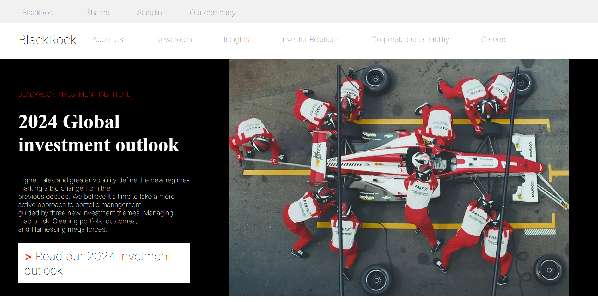
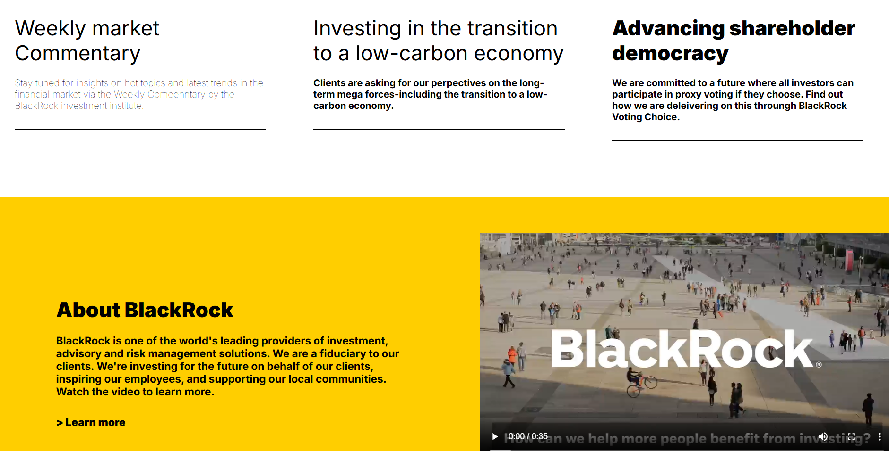
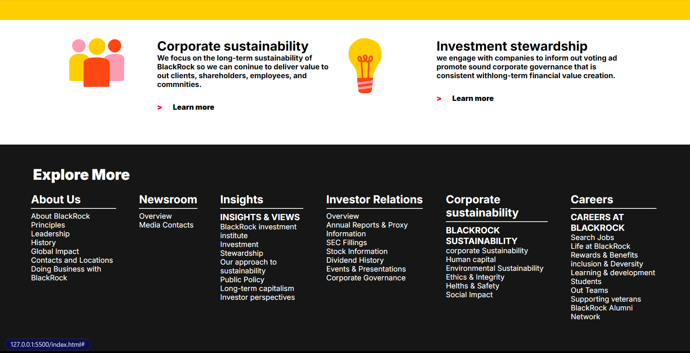
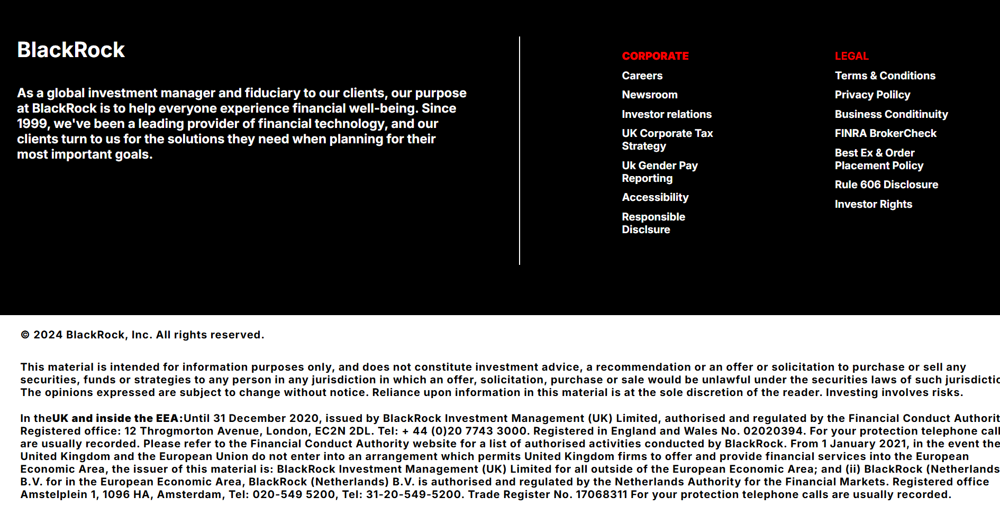

# BlackRock (BlackStone) Homepage Clone 🚀

> **Live Demo:** [Explore the Live Site](https://marsalshyam.github.io/BlackStone_Webste_frontend_clone/)
>
> **GitHub Repository:** [MarsalShyam/BlackStone_Webste_frontend_clone](https://github.com/MarsalShyam/BlackStone_Webste_frontend_clone)

---

## 📖 The Story Behind the Project

Every developer has that defining moment—the spark of confidence that makes them want to test their limits. 

After recently learning the fundamentals of **HTML** and **CSS**, I was feeling incredibly confident. I believed I could build *anything* in the frontend. While exploring different corporate sites, I came across the **BlackRock** corporate website (which I affectionately called **BlackStone** in my repository). 

Seeing the sleek, complex, and professional layout of their homepage, I thought to myself: *"Can I clone this?"* 

Instead of backing down, I took on the challenge. I built the entire homepage clone completely by myself from scratch, translating design elements into clean markup and style. This project stands as proof of my early developer journey—proving that with determination and the right fundamentals, you can build what you set your mind to.

---

## 🛠️ Tech Stack & Concepts Applied

*   **HTML5:** Structured using semantic markup (`header`, `nav`, `main`, `footer`, and interactive native `<video>` elements).
*   **CSS3:** Layout designed using **Flexbox**, responsive sizing (`vw`, `vh`, `%`), custom fonts, hover effects, and clean CSS styling.
*   **Typography:** Google Fonts (`Inter`, `Montserrat`, and `Open Sans`) integration to replicate corporate branding.

---

## ✨ Features & Sections Cloned

1.  **Dual Navigation Header:** 
    *   Top navigation (`#nav1`) for quick access to associated sites (BlackRock, iShares, Aladdin).
    *   Primary navigation (`#nav2`) featuring the corporate logo and primary site tabs.
2.  **Hero Showcase:** 
    *   A clean split-screen section showcasing the *2024 Global Investment Outlook* with custom typography and Call to Action (CTA).
3.  **Insights & Transition Cards:**
    *   A grid-like card layout using Flexbox to present market commentary and low-carbon economy articles, featuring subtle line-divider hover micro-animations.
4.  **Multimedia Integration:**
    *   A custom media block embedding a video detailing BlackRock's corporate mission.
5.  **Multi-Column Navigation Footer:**
    *   A dark-themed, organized corporate navigation directory spanning multiple columns (About Us, Newsroom, Insights, Careers, etc.).
6.  **Full Corporate Disclaimer Footer:**
    *   Detailed global legal notices styled cleanly with strict typography hierarchy, mimicking the actual financial advisory guidelines.

---

## 📸 Screenshots

Here is how the cloned sections look:

### Hero & Outlook Banner


### Market Commentary & Cards


### About Video Section


### Corporate Directory & Footer


---

## 🚀 How to Run Locally

Since this is a lightweight frontend clone built with pure HTML and CSS, you can run it instantly:

1.  **Clone the Repository:**
    ```bash
    git clone https://github.com/MarsalShyam/BlackStone_Webste_frontend_clone.git
    ```
2.  **Navigate into the directory:**
    ```bash
    cd BlackStone_Webste_frontend_clone
    ```
3.  **Open in your browser:**
    Simply double-click the `index.html` file or run it via a local development server like VS Code's Live Server.

---

### 💡 Reflection & Learnings
Building this clone taught me:
*   How to structure dense layouts without using bloated libraries.
*   The power of **CSS Flexbox** for creating clean column arrangements.
*   The importance of precision in styling (margins, padding, alignment) to match real-world, high-traffic corporate websites.
